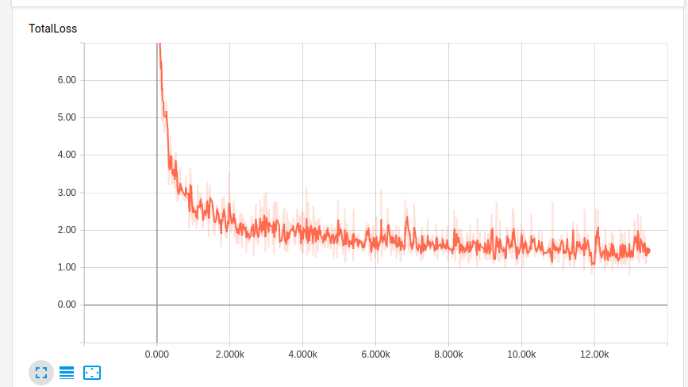
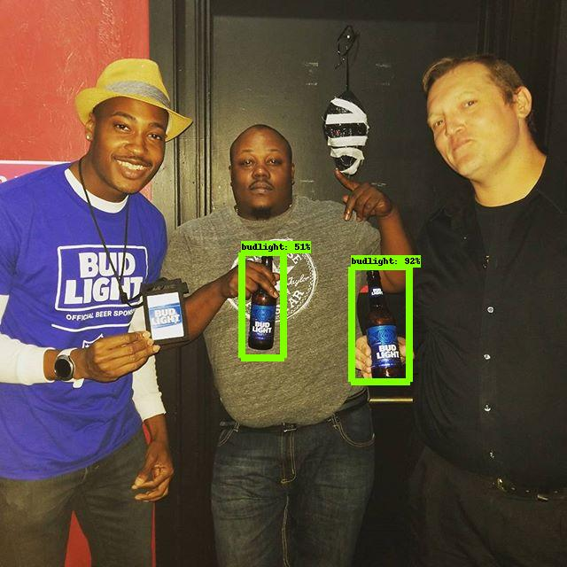
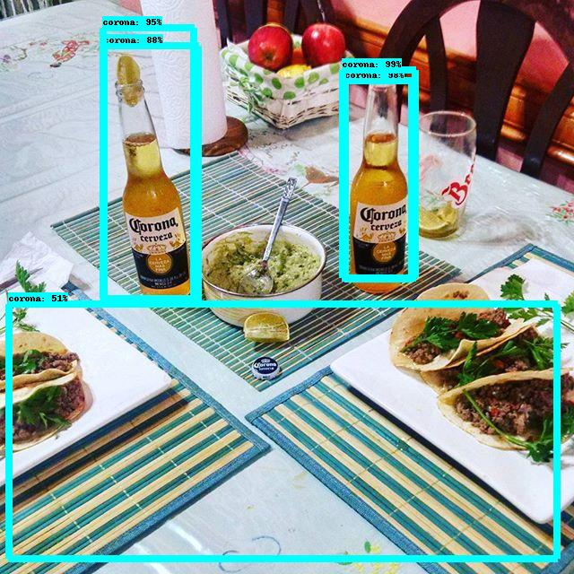
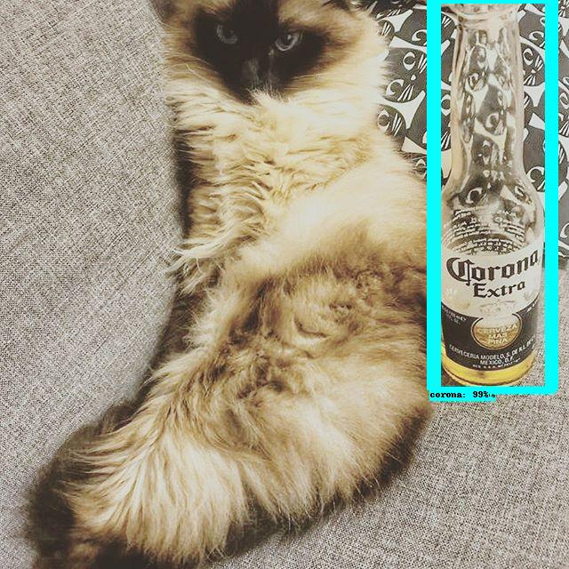
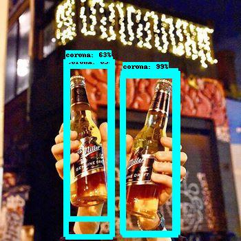
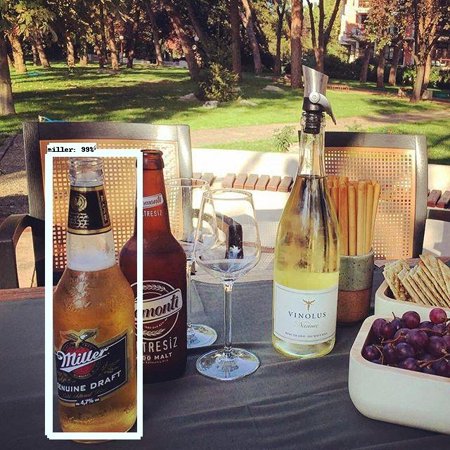
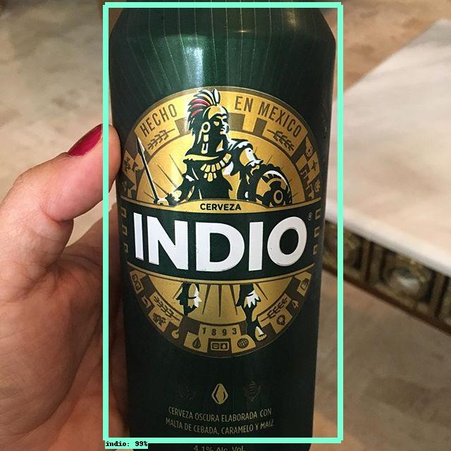
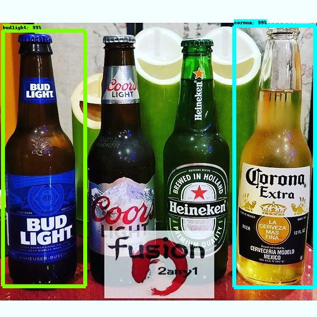
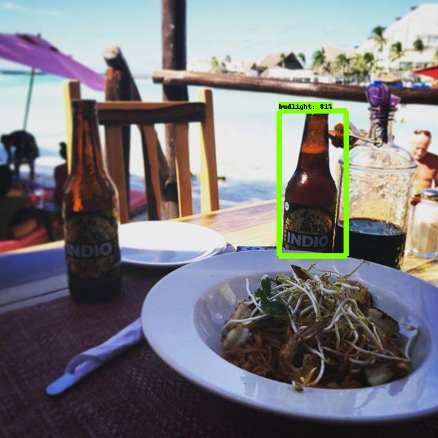
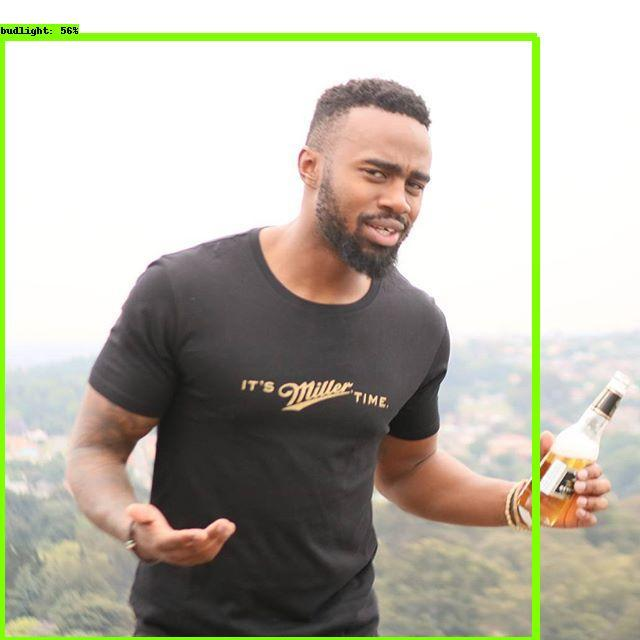

# Deteccion de objetos en imagenes

## Introduccion
Este trabajo pretende llevar paso por paso el proceso de identificacion de objetos en imagenes utilizando la API de Tensorflow [Tensorflow Object Detection API](https://github.com/tensorflow/models/blob/master/research/object_detection/README.md). Mas específicamente vamos a identificar botellas de cerveza y su respectiva marca.

## Instalación
La API de tensorflow utiliza las siguientes librerias:
*Protobuf 2.6
*Pillow 1.0
*Lxml
*Tf slim
*Jupiter notebook
*Matplotlib
*Tensorflow

[Instalacion](https://github.com/tensorflow/models/blob/master/research/object_detection/g3doc/installation.md) <- entrar aqui en caso de requerir informacion mas detallada.

## Generación de datos
Uno de de los puntos mas importantes al momento de querer entrenar una red neuronal de cualquier tipo, es tener la cantidad adecuada de datos para los respectivos conjuntos *datos de entrenamiento* y *datos de prueba*. En dado caso no se cuenten con los suficientes datos, se pueden generar datos sintéticos. En este caso se esta trabajando con imagenes que contengan botellas de cerveza, por lo tanto manipularemos imagenes de este tipo para generar muchas imagenes a partir de un conjunto relativamente pequeño.

[Generado de imagenes](Generado_Imagenes/GI.ipynb)

## Generando conjunto "train" y "test"
Para poder generar estos conjuntos primero necesitamos realizar el marcado a cada una de nuestras imagenes en el conjunto de datos, unas vez obtenidos los archivos .xml con las etiquetas de cada imagen crear los archivos tipo .cvs y posteriormente tranformarlos a .record que es lo que utiliza __Tensorflow__.

1. [Marcado de imagenes](marcado.md)
2. [Crear los archivos cvs](xml_a_cvs.md)
3. [Creando los archivos record](cvs_a_record.md)

## Creando el modelo
Una vez generados los archivos tfrecord necesitaremos los archivos de *configuration file* y *label map*. Hay dos opciones, utilizar un modelo pre-entrenado o entrenarlo desde cero. Yo recomiendo utilizar un modelo pre-entrenado dado que entrenarlo desde cero seria muy tardado. En caso de eleguir la segunda opcion puedes ver como hacerlo [aqui](https://github.com/tensorflow/models/blob/master/research/object_detection/g3doc/configuring_jobs.md). Si quieres utilizar un modelo pre-entrenado la API de object detection provee de algunos ejemplos que puedes ver [aqui](https://github.com/tensorflow/models/tree/master/research/object_detection/samples/configs).
Si utilizas modelo pre-entrenado del *configuration_file* busca todos los *PATH_TO_BE_CONFIGURED* y modificalos. Tambien modifica el *num_classes* y el *label_map_path*

Este seria mi archivo *label_map* :
```
item {
  id: 1
  name: 'budlight'
}
item {
  id: 2
  name: 'corona'
}
item {
  id: 3
  name: 'indio'
}
item {
  id: 4
  name: 'miller'
}
```
Para empezar el entrenamiento desde  *models/research/object_detection* ejecutar:

```
python train.py --logtostderr --train_dir=training/ --pipeline_config_path=training/{*TU_CONFIGURATION_FILE*}.config
```

Una vez empezado el entrenamiento puedes verificar los avances desde *Tensorboard* ejecutando el siguiente comando en consola desde *models/research/object_detection*:

```
tensorboard --logdir='training'
```

Mi grafica de perdida fue la siguiente:



## Resultados
Los resultados en general fueron buenos, por ejemplo:






Para la cerveza indio reconoce tanto botellas como botes :                                        
 

 Varias cervezas juntas en una imagen:                                        
  

En otras ocaciones no identifico todos los objetos de la imagen, por ejemplo:



Y algunos resultados raros como:                                   


