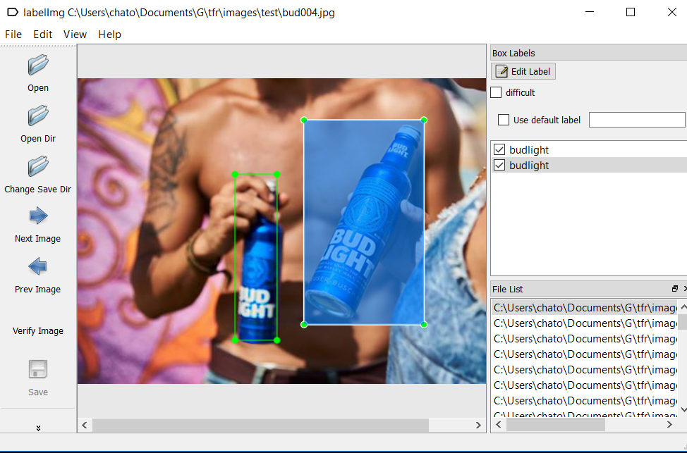

## Marcado de Generado_Imagenes

### LabelImg
La herramienta que utilice para realizar el marcado de imagenes fue LabelImg, con la cual se genera un archivo xml.
Ejemplo:

[LabelImg](https://github.com/tzutalin/labelImg) <- Link de descarga
